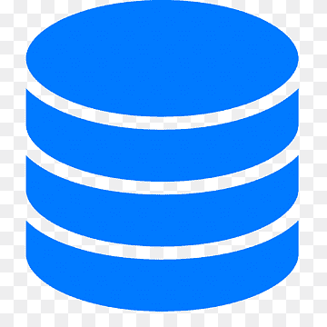

# Express.js

This app will help me take a deeper look into the Express.js framework. I will be looking at the documentation and following along with their tutorials. I will also be looking at other resources to help me understand the framework better.

The documentation can be found here: https://expressjs.com/en/starter/installing.html

<br/>

## Installation

```bash
mkdir my_testing_app
cd my_testing_app
```

The documentation then also says to run the following command:

```bash
npm init -y
```

This command will create a package.json file. This file will contain all the dependencies for the project. The -y flag will skip the prompts and just create the file.

The only difference I see from this command and the one used in class is that in class we use:

```bash
npm init
```

This command will prompt you for the information needed to create the package.json file. The command used in class does allow you to designate a `main` file, as opposed to when we use the `-y` flag. Which defaults main to be `index.js`.

For the purposes of class we will declare the main file as `app.js`. But let's continue with the `express.js` documentation.

The next step is to install `express.js` into our project. We can easily accomplish this by running the command below:

```bash
npm install express --save
```

In the command above we see a different flag: `--save`.

The `--save` flag will add the dependency to the package.json file. This will allow us to easily install all the dependencies for a project when we clone it down from GitHub in the future in another directory.

The documentation also specifies another command if we wish to install `express.js` temporarily:

```bash
npm install express --no-save
```

Upon reading the fine print in the documentation it states that just running the command:

```bash
npm install express
```

Will install the dependency and add it to the package.json file. This is done by default with npm version 5.0.0 and above. So let's run that command.

To shorten the command even more I found out we can just run:

```bash
npm i express
```

This will literally just do what we want without having to write the whole command or in this case the whole word ... `install`. xD

<br/>

# Entry Point

In order to combine both the logic of the documentation and the logic learned in class I will do my best to mesh the two together. Our default entry point according to the documentation is `index.js`. But in class we learned that we can change this to `app.js`. So let's do that.

In the `package.json` file we will change the `main` property to be `app.js`.

```json
"main": "app.js"
```

Let's create that file:

```bash
touch app.js
```

Creating an entry point file called `app.js` will allow the app we are creating to execute the code in that file when we run the command:

```bash
node app.js
```

The code stored in this file will define the routes and middleware for our application. The logic written in `app.js` will be the logic that will be executed when a user visits a specific route. It will handle different HTTP requests and return the appropriate responses.

<br/>

### Pro-Tip

When creating a `.gitignore` file for any project and you want it filled with default values for a react-app which is what we've been working on you can use the following `npm` package:

```bash
npx react-gitignore
```

<br/>
<br/>
<br/>

# Responses

## Routes & Middleware

Routes and middleware are two key concepts in `express.js` that are used to define the behavior of the application we are building.

<br/>

## Routes

Routes are used to define how the application will respond to HTTP requests. A route is defined using the `app.METHOD()` syntax, where the `METHOD` is the HTTP request method, in lowercase. The following code is an example of a route that will respond with `Hello World!` to GET requests to the root route, or `/`:

```js
app.get("/", (req, res) => {
  res.send("Hello World!");
});
```

The first argument of the `app.get()` function is the path of the route. In this case it would be the `home` path defined by `/`. The second argument is the callback function that will be executed when the `home` route is matched.

The callback function takes two arguments: `req` and `res`. The `req` argument represents the HTTP request and has properties for the request query string, parameters, body, HTTP headers, and so on. The `res` argument represents the HTTP response that the Express app will send when it receives an HTTP request.

Since the second argument of the `app.get()` function is a callback function we can also create a separate function to handle the request and response. This will allow us to keep our code organized and clean.

```js
const homeHandler = (req, res) => {
  res.send("Hello World!");
};

app.get("/", homeHandler);
```

<br/>

Furthermore to keep code organized we can use the `express.Router()` class to create modular, mountable route handlers. A Router instance is a complete middleware and routing system; for this reason, it is often referred to as a `mini-app`. At this point in time I feel that this is a bit too much for me to understand. So I will continue to follow the documentation and come back to this later.

<br/>

The following code creates a simple `app` that will respond with `Hello World!` to GET requests to the root route, and `About me` to GET requests to the `/about` route:

```js
const express = require("express");
const app = express();

const homeHandler = (req, res) => {
  res.send("Hello World!");

const aboutHandler = (req, res) => {
  res.send("About me");
};

app.get("/", homeHandler);

app.get("/about", aboutHandler);

module.exports = app;
```

<br/>

The `module.exports` line is used to export the `app` object so that it can be used in other files. This is done so that we can use the `app` object in our `app.js` file.

<br/>

## Middleware

In `express.js` middleware are functions that can be executed before the final request handler callback is invoked. Middleware functions have access to the `request` and `response` objects. This means that they can perform operations on them, such as modifying request headers, processing data, handling errors, or even ending the request-response cycle.

One thing to note about middleware is that they are executed in the order that they are defined. This is important to keep in mind when defining middleware functions. Each middleware function has the ability to modify the request and response objects. This means that middleware functions can perform the following tasks:

- Execute any code.
- Make changes to the request and the response objects.
- End the request-response cycle.

If the current middleware function does not end the request-response cycle, it must call `next()` to pass control to the next middleware function. Otherwise, the request will be left hanging.

<br/>

Without going to deep into this topic I will write an example of middleware functions:

```js
const express = require("express");
const app = express();

// middleware function that will log the current date and time
const logDateTime = (req, res, next) => {
  console.log(new Date());
  next();
};

// middleware function that will log the user agent header
const logUserAgent = (req, res, next) => {
  console.log(req.headers["user-agent"]);
  next();
};

// route handler
const rootHandler = (req, res) => {
  res.send("Hello World!");
};

// register the middleware functions
app.use(logDateTime);
app.use(logUserAgent);

// register the route handler
app.get("/", rootHandler);

module.exports = app;
```

<br/>

The code above defines two middleware functions called `logDateTime` and `logUserAgent`. These functions will log the current date and time and the user agent header respectively. The `logDateTime` function will call the `next()` function to pass control to the next middleware function. The `logUserAgent` function will also call the `next()` function to pass control to the next middleware function. In this case there is no next middleware function. So the request-response cycle will end.

<br/>

### Registering Middleware

We register middleware functions by calling the `app.use()` function. The `app.use()` function can be called with a single argument. This argument can be a function or a path. If the argument is a function then the function will be registered as a middleware function. If the argument is a path then the function will be registered as a route handler.

<br/>

## Use of middleware

When we start the server, we can see the middleware functions in action in the console. First is the `logDateTime` function and the next would be the `logUserAgent` function. The following is the output of the code above:

```bash
2020-05-31T20:00:00.000Z

Mozilla/5.0 (Macintosh; Intel Mac OS X 10_15_4) AppleWebKit/537.36 (KHTML, like Gecko) Chrome/83.0.4103.116 Safari/537.36
```

These would be outputed to the console when we visit the root route. The `logDateTime` function will log the current date and time. The `logUserAgent` function will log the user agent header.

<br/>

# We've deviated from the documentation tutorials long enough. Let's get back on track!

<br/>

# Hello World

Let's start with the most basic of examples. We will create a simple `Hello World` app. This will be a great way to get started with Express.js.

First we will need to import the `express` module into our `app.js` file. The same `express` that we installed previously.

We will do this by using the `require` function. We will also need to create an instance of the `express` module. We will do this by calling the `express` function.

```js
const express = require("express");
const app = express();
```

The first line in the code above not only imports the `express.js` module but also assigns it to the variable `express`. This is done so we can use the `express` variable to call the `express` function.

The second line creates an instance of the `express.js` module and assigns it to the variable `app`. This will allow us to use the `app` variable to call the methods of the `express.js` module. The `app` variable can also be described as an object that contains all the methods of the `express.js` module.

<br/>
 
## Port Number

The next thing we need to do is to define the port number that our server will listen on. We will do this by creating a variable called `port` and assigning it the value `3000`.

```js
const port = 3000;
```

In class we've gone a step further and created a `.env` file to store our port number. This is a great way to keep our port number secure.

We can do this by creating a `.env` file in the root directory of our project.

```bash
touch .env
```

We will then add the following line to the `.env` file:

```bash
PORT=3000
```

<br/>

## Using the `.dotenv` npm package

<br/>

We can then access the port number by using the `process.env` object. The `process.env` object is a global object that contains all the environment variables as properties. We can access the port number by using the following code:

```js
const port = process.env.PORT;
```

At this time this will not work. This is because this is a simple `Hello World` app. We will need to install the `dotenv` module to make this work. We can do this by running the following command in the terminal:

```bash
npm i dotenv
```

Now we can update our code to take advantage of this package we've installed. We will need to import the `dotenv` module into our `app.js` file. We can do this by writting the following line of code in our `app.js` file:

```js
require("dotenv").config();
```

The `require` function will import the `dotenv` module into our `app.js` file. The `config()` function will load the environment variables from the `.env` file into the `process.env` object.

While checking my notes against `chatGPT` it mentioned that it is good practice to wrap the `require` function in a conditional statement. This is to prevent the `dotenv` module from being loaded in production. We can do this by writting the following code:

```js
if (process.env.NODE_ENV !== "production") {
  require("dotenv").config();
}
```

At this time this information even though it is insightful, it is not necessary at this moment where we are following the tutorials in the `express.js` documentation.

<br/>

Now we can finally update our code to use the `process.env` object to access the port number. We can do this by writting the following code:

```js
const port = process.env.PORT;
```

<br/>

So far I'm understanding the logic of the code that I'm writing. Right now I'm using different sources at the same time to get a better understanding of what I'm doing. I'm using the `express.js` documentation, the class notes, and the infamous `chatGPT` to double check my notes.

Our code should look something like this right now:

```js
require("dotenv").config();

const express = require("express");
const app = express();

const PORT = process.env.PORT || 3000;
```

<br/>

## Route Handler

The next thing we need to do is to create a route handler. We will do this by calling the `app.get()` function. The `app.get()` function takes two arguments. The first argument is the path. The second argument is the route handler. The route handler is a function that will be called when the path is requested. I like to keep my code clean and organized. So I will create a separate function for the route handler. I will call this function `rootHandler`. The `rootHandler` function will take two arguments. The first argument is the `request` object. The second argument is the `response` object. The `request` object contains all the information about the request. The `response` object contains all the methods to send a response to the client.

```js
const rootHandler = (req, res) => {
  res.send("Hello World!");
};

app.get("/", rootHandler);
```

After this we can start the server by calling the `app.listen()` function. The `app.listen()` function takes two arguments. The first argument is the port number. The second argument is a callback function. The callback function will be called when the server is started.

```js
app.listen(port, () => {
  console.log(`Server started on port ${port}`);
});
```

<br/>

## Running the server

There are two commands that can start running our server. The first command is `node app.js`. The second command is `nodemon app.js`. The `nodemon` command will start the server and will restart the server whenever a change is made to the code. The `node` command will only start the server once. We will use the `nodemon` command for this tutorial.

```bash
nodemon app.js
```

<br/>

### Pro-Tip

Sometimes we may forget to kill the server correctly before putting the computer to sleep and the next time you try to start your server it says that something is already running on that port. To fix this we must first find the process to do this we can run the `ps` command (process status) combined with the `-A` flag (all). This will list all the processes that are currently running. We can then use the `grep` command (global regular expression print) to filter the results and search for nodemon specifically. We can do this by running the following command:

```bash
  ps -A | grep nodemon
```

If `nodemon` is running, you should see something like this:


On the left of the image you should see the process id. In this case we are looking at the line right underneath our command. The process id is `3682`. We can then use the `kill` command to kill the process. We can do this by running the following command:

```bash
kill 3682
```

<br/>

# Requests

## Separating Concerns

In order to create maintainable, scalable, and testable applications, it's essential to separate concerns in our code. By dividing the application into smaller, specialized parts, we can better mannage complecity, isolate errors, and facilitate easier testing. In the context of `express.js` apps, this typically involves organizing the server setup, routing, middleware, and other logic into different files or modules.

To achieve this separation of concerns, we can use the `node.js` modules. The `node.js` modules allow us to create reusable pieces of code that can be imported and exported between different files in our app. We can see a difference when we import an npm package like `express` where we can just call the `require` function and pass in the name of the package.

First we must write `module.exports` and then we can assign the value to whatever we want to export. In this case we will export the `app` object. The following code will be written at the very end of our `app.js` file.

```js
module.exports = app;
```

This in turn will allow us to import the `app` object in our `server.js` file. We can do this by writting the following code:

```js
const express = require("express");
```

However, when we are importing code from our custom local files, we need to provide the relative path to the file.

```js
const app = require("./app");
```

<br/>

In this application we will make use of two files:

- `app.js`
- `server.js`

We already have the `app.js` file. So let's create the `server.js` file.

```bash
touch server.js
```

Now that we have both files let's define what both files will be in charge of.

The `app.js` file will be in charge of the logic of the application. This includes the route handlers, the middleware, and the database connection.

The `server.js` file will be in charge of the server setup. This includes the server setup, the server start, and the server shutdown. p.s. in class we have not covered the server shutdown. So we will not be covering it just yet.

The following code will live in the `server.js` file:

```js
require("dotenv").config();

const app = require("./app");

const PORT = process.env.PORT || 3000;

app.listen(PORT, () => {
  console.log(`Server started on PORT ${PORT}`);
});
```

We must also update our `package.json` file to include the `server.js` file as the entry point of our application. We can do this by updating the `start` script to the following:

```json
"start": "server.js"
```

By doing all of this, we can access the exported contents of `app.js` in the `server.js` file. This allows us to keep the server setup and the application logic separate, therefore making it easier to manage and test our code. Keeping it clean!

Separation of concerns in our code is a very important concept to understand. It will help us write better code and make our code easier to maintain. By organizing our code into smaller, specialized modules, we can better manage complexity, isolate errors, and greatly enhance the maintainability, scalability, and testability of our applications.

I have decided to move from the tutorials and mesh what is being learned in class so from here on out we will be learning about the concepts that are being taught in class.

<br/>

## Building an App

Our instructor's concern is to help us learn `express.js`. Later we will dive into databases and how to integrate a database into our express app.

Right now we will be using mock data like an array to help us learn the fundamentals of `express.js`.

<br/>

## Creating Mock Data

```bash
mkdir models
touch models/rock.js
```

Inside our `rock.js` file we will create an array of strings. Each object will represent a rock. The following code will be written in the `rock.js` file:

```js
const rocks = ["Crocoite", "Wulfenite", "Amber", "Malachite", "Azurite", "Amethyst"];

module.exports = rocks;
```

At this point to make use of our mock data about rocks we will need to require it in our `app.js` file where we are writing out our logic for this app.

Our `app.js` file should look like this:

```js
// DEPENDENCIES
const express = require("express");
const rocks = require("./models/rocks");

// CONFIGURATION
const app = express();

// ROUTE HANDLERS
const rootHandler = (req, res) => {
  res.send("Hello World");
};

const rocksHandler = (req, res) => {
  res.json(rocks);
};

// ROUTES
app.get("/", rootHandler);
app.get("/rocks", rocksHandler);

// EXPORT
module.exports = app;
```

Now when we visit the `/rocks` route we will see the following:


<br/>

## Keeping it DRY

What if we wanted to show each rock? We could create a new route handler and a new route. However, this would be very repetitive and not very DRY. We can use a route parameter to make this more dynamic. A route parameter is a variable that we can use to capture the value of a segment of the request URL. We can then use this value to perform some logic or to access some data.

In our case we will use the route parameter to access the index of the rock we want to show. We can do this by adding a colon in front of the name of the route parameter. In this case we will call it `index`.

```js
const rocksHandler = (req, res) => {
  res.send(req.params);
};
app.get("/rocks/:index", rocksHandler);
```

if we visit the `https://localhost:3000/rocks/0` route we will see the following:


But this is not what we want. What we want is the string of the rock at the index of 0. We can do this by using the `req.params` object. Which is as we can see in the above image just this at the moment:

```js
{
  index: "0";
}
```

We can access the value of the `index` key by using the following code:

```js
app.get("/rocks/:index", (req, res) => {
  res.send(rocks[req.params.index]);
});
```

Now when we visit the `https://localhost:3000/rocks/0` route we will see the following:


## A Common Error

The HTTP protocol enforces a rule that for each request, there can only be one response. If you attemp to send multiple responses for a single request, you will encounter and error. The example below will violate that rule:

```js
app.get("/rocks/:index", (req, res) => {
  res.send(rocks[req.params.index]);

  // cannot send more than one response
  res.send("Hello World");
});
```

you will get the following error:

```bash
Error [ERR_HTTP_HEADERS_SENT]: Cannot set headers after they are sent to the client
```

However, you can send different responses based on conditions using control structures like `if` statements. This will allow us send only one response per request, depending on the situation:

```js
app.get("/rocks/:index", (req, res) => {
  if (rocks[req.params.index]) {
    res.send(rocks[req.params.index]);
  } else {
    res.send("Sorry, that rock does not exist");
  }
});
```

In the corrected example, we are using and `if` statement to check if the rock at the index of `req.params.index` exists. If it does we will send the rock. If it does not we will send a message saying that the rock does not exist. This ensures that we are only sending one response per request, adhering to the HTTP protocol's rule.

It is essential to remember that we can only send one response for each request, as required by the HTTP protocol. Using control structures like `if` statements can help us achieve this while still providing the desired functionality.

## Ordering Routes Correctly

`express.js` processes routes in the order they are defined in your `app.js` file, attempting to match the requested URL with the routes sequentially. This means that the order in which you define your routes is important, as it can impact the behaviour of your application.

Consider the following example where we have these routes in the given order:

```js
// INCORRECT ORDER
app.get("/rocks/:index", (req, res) => {
  res.send("This is a rock");
});

app.get("/rocks", (req, res) => {
  res.send("This is a list of rocks");
});
```

In this case, when the user tries to access `/rocks`, the first route will match and the response will be `This is a rock`. This is because the `:index` route parameter will match any value, including `rocks` or even an empty string. The `/rocks` route will never be triggered in this scenario, as `express.js` processess the routes sequentially and will stop at the first match.

To resolve this issue we should place more specific routes before the more generic ones:

```js
// FIXED ORDER
app.get("/rocks", (req, res) => {
  res.send("This is a list of rocks");
});

app.get("/rocks/:index", (req, res) => {
  res.send("This is a rock");
});
```

Now when a user requests `/rocks`, Express.js will first try to match the route with the more specific route, and only if that fails will it try to match the route with the more generic route. By organizing our routes from more specific to more generic, we can ensure that the correct route is triggered for each request. This will lead to more predictable and accurate app behaviour.

<br/>

## Multiple Route Parameters

When dealing with multiple route parameters, we can use the `req.params` object to access the values of each parameter. Consider the following example:

```js
const multipleParamsHandler = (req, res) => {
  res.send(req.params);
};

app.get("/rocks/:index/:name", multipleParamsHandler);
```

This will result in the following output:


As you can see above we can access/define multiple route parameters by separating them with a `/` and `:`. We can then access the values of each parameter by using the `req.params` object.

Using multiple parameters in a route allows you to create more specific routes that can handle a wider range of requests. It also makes it easier to extract relevant information from the URL and use it to generate dynamic content.

<br/>

## Query Parameters

Query parameters or strings are a useful method for passing values in the URL, often used to provide additional data or filter results. They appear at the end of a path, starting with a question mark `?`, and consist of key-value pairs with the syntax `key=value`. Multiple key-value pairs can be included in the URL and are separated by an ampersand `&`.

Consider the following example:

```js
const calulatorQueryHandler = (req, res) => {
  const { num1, num2 } = req.query;
  const sum = Number(num1) + Number(num2);
  res.send(`The sum of ${num1} and ${num2} is ${sum}`);
};

app.get("/calculator/add?num1=5&num2=4", calulatorQueryHandler);
```

We have to understant that the query parameters are not part of the route. They are part of the URL. So we can access them using the `req.query` object. We can then use the values of the query parameters to perform some calculations and send the result back to the user. In the above example we are adding two numbers together and sending the result back to the user. But before making the calculation we have to convert the values of the query parameters to numbers using the `Number()` function. This is because the values of the query parameters are always strings.

We can further expand on this example to take into account the operation that must be made with these two numbers. We can do this by adding a new route parameter to the route and change our logic a bit in our handler function to compensate for the operation that needs to be executed:

```js
const calculationHandler = (req, res) => {
  // extract the values of the query parameters
  const { num1, num2 } = req.query;

  // declare a variable to store the result of the calculation
  let result = 0;

  // extract the operation from the route parameters
  const { operator } = req.params;

  // perform the calculation based on the operation
  if (operator === "add") {
    result = Number(num1) + Number(num2);
  } else if (operator === "subtract") {
    result = Number(num1) - Number(num2);
  } else if (operator === "multiply") {
    result = Number(num1) * Number(num2);
  } else if (operator === "divide") {
    result = Number(num1) / Number(num2);
  }

  // send the result back to the user
  res.send(`The result of ${num1} ${operator} ${num2} is ${result}`);
};

app.use("/calculator/:operation", calculationHandler);
```

The enhanced example above allows us to perform different calculations based on the operation that is passed in the route parameters. We can now access the operation using the `req.params` object and use it to perform the correct calculation. We can then send the result back to the user.

Query parameters provide a powerful way to pass additional data or filter information through URLs. By parsing and converting these values as needed, you can create dynamic and adaptable endpoints that handle a wide range of use cases.

<br/>

# Dynamic Web Content with Express.js

In modern web development, websites like Etsy need to generate dynamic web pages based on user-provided data, like when a shop owner adds a new product. Rather than manually creating each page, developers utilize templates and data-driven techniques to generate content automatically. `express.js`, combined with templating engines, can achieve this functionality.

The following is some data that will be submitted by the user and the browser will send a `request` to a server. The server will then process the `request` and send a `response` back to the browser. The browser will then render the `response` and display it to the user.

```json
{
  "name": "John Doe",
  "age": 30,
  "hobbies": ["music", "movies", "sports"],
  "address": {
    "street": "50 Main st",
    "city": "Boston",
    "state": "MA"
  }
}
```

<br/>

Then the server will `respond` with confirmation that the `request` went through successfully or it will provide and error message.

When the owner of the website wishes to see the data that was submitted by the user, the server will `respond` with the data that was submitted by the user. Like this:

```html
<!DOCTYPE html>
<html lang="en">
  <head>
    <meta charset="UTF-8" />
    <meta name="viewport" content="width=device-width, initial-scale=1.0" />
    <title>Document</title>
  </head>
  <body>
    <h1>John Doe</h1>
    <ul>
      <li>Age: 30</li>
      <li>Hobbies: music, movies, sports</li>
      <li>Address: 50 Main st, Boston, MA</li>
    </ul>
  </body>
</html>
```

There are four main things to do with the data that was submitted by the user:

- Create
- Read
- Update
- Delete

These four things are called `CRUD` operations. `CRUD` operations are the basic functions of persistent storage. `CRUD` is an acronym that comes from the world of computer programming and refers to the four functions that are considered necessary to implement a persistent storage application.

<br/>

# Software Architecture: MVC [ Model View Controller ]

In software engineering, `MVC` is a software architecture pattern that separates an application into three main logical components: the `model`, the `view`, and the `controller`. Each of these components are built to handle specific development aspects of an application.

The architecture of a software system is like the blueprint of a building. It serves as a plan for the system and the project, helping project management and developers figure out the tasks that need to be done by the teams and people involved.

Software architecture is about making important structural decisions that are hard to change once they're in place. These choices involve picking specific design options for the software.

For example, the systems controlling the Space Shuttle needed to be very fast and reliable. So, a suitable real-time computing language had to be chosen. To make sure the systems was reliable, they could decide to use multiple copies of the program, running on separate hardware and checking results with each other. This is called `fault tolerance`.

Following this pattern allows developers to separate the concerns of the data. The `model` is responsible for managing the data of the application. The `view` is responsible for displaying the data to the user. The `controller` is responsible for handling user input and performing interactions on the data model objects. A pattern is a recommendation, not a rule.

In our class we will be learning to keep our code organized in two different folders one of them being the `models` folder and the other being the `controllers` folder. The `models` folder will contain all of our data and the `controllers` folder will contain all of our functions that will be used to manipulate the data.

### Pro-Tip

With `Express.js`, we can name our files and folders whatever we want. However, no one will understand how your code is organized with names that don't make sense/are not semantic.

# REMINDER TO FINISH THIS SECTION

<br/>

# Intro to Databases / SQL

## Lesson Objectives

- Define databases and their role in a full-stack application.
- Introduction to PostgreSQL.
- Set up and drop (delete) a (sub) database.
- Create a table, set columns, and drop a table.
  = Create a row and put it in a table. (insert data)
- Read data from a table. (query data)
- Update data in a table.
- Delete data from a table.
- Bonus: Limit, Sort, and Aggregate data.

<div style="height:50px"></div>

## What is a Database?

<hr/>

A database is an organized collection of data that is stored and accessd electronically.

In class we have been creating CRUD apps, so far we've been hard-coding the data to get started. We can make temporary changes to this data, but the changes would disappear when we restart the server.

In class we've discussed that we need data in our database to stay put even after we restart the server. We need a way to store data permanently. We need an actual working database. Which will allow us to store and access our data.

Databases are essential tools that enable us to store, manage, and retrive data in an organized and efficient manner. They can be hosted on a single computer or distributed across multiple computers (servers), depending on the needs of the organization and the scale of data management.

One of the key features of databases is their ability to handle concurrent access by multiple users. This functionality allows for simultaneous data retrieval, modification, and storage by different individuals, ensuring smooth and efficient operations within an organization.

Databases are critical components in various sectors, including finance, healthcare, retail, and technology, as they facilitate the management of vast amounts of data and streamline complex processes. With the growing importance of data-driven decision making, databases play a pivotal role in driving sucess of businesses and organizations worldwide.

There are indeed numerous types of databases available, with relational databases being one of the most common. Relational databases store data in a structured format, using tables with rows and columns, similar to Excel or Google Spreadsheets. This structure allows for easy organization and retrieval of information (data), as well as the establishment of relationships between different data sets.

To interact with relational databeses, we will use SQL ( Structured Query Language ), a powerful coding language specifically designed for managing and querying data in these databases. SQL enables users to create, read, update, and delete data, as well as perform complex data manipulation and analysis.

Some popular Relational Database Management Systems (RDBMS) that use SQL include:

1. MySQL - Open-source RDBMS that is widely used in web applications, offering high performance, flexibility, and reliability.

2. Oracle - A commercial RDBMS that is commonly used in large enterprises, offering high performance, scalability, and security.

3. SQL Server - A Microsoft RDBMS that is commonly used in Windows environments, that provides comprehensive data management and integration services. It is also available on Linux.

4. SQLite - A lightweight, open-source RDBMS that is commonly used in mobile and embedded applications, offering high performance and reliability. Mostly used for small-scale projects.

5. PostgreSQL - An open-source RDBMS that is known for its extensibility, adherence to SQL standards, and support for advanced data types.

Each of these RDBMS have their own unique features and advantages, making them suitable for different applications and enviroments. In this course, we will be using PostgreSQL.

<br/>

Below is a table that summarizes some key features of the RDBMS mentioned above. Please note that this table is not exhaustive, and that the features listed are not mutually exclusive. Each RDBMS has its own unique features and advantages, making it suitable for different applications and environments.

<table>
  <tr>
    <th>RDBMS</th>
    <th>Open Source</th>
    <th>Good for Web Apps</th>
    <th>Good for Large Enterprises</th>
    <th>Good for Mobile Apps</th>
    <th>Good for Small-scale Projects</th>
    <th>Known for</th>
    <th>Additional Specifics</th>
  </tr>
  <tr>
    <td rowspan="2">MySQL</td>
    <td rowspan="2">✅</td>
    <td rowspan="2">✅</td>
    <td rowspan="2">✅</td>
    <td rowspan="2">✅</td>
    <td rowspan="2">✅</td>
    <td rowspan="2">High performance, flexibility, reliability</td>
    <td>- Extensive support for JSON data</td>
  </tr>
  <tr>
    <td>- Replication and partitioning support</td>
  </tr>
  <tr>
    <td rowspan="2">Oracle</td>
    <td rowspan="2">❌</td>
    <td rowspan="2">❌</td>
    <td rowspan="2">✅</td>
    <td rowspan="2">❌</td>
    <td rowspan="2">❌</td>
    <td rowspan="2">Scalability, robustness, advanced features</td>
    <td>- Advanced security features (e.g., data encryption, auditing)</td>
  </tr>
  <tr>
    <td>- Support for PL/SQL (Procedural Language for SQL)</td>
  </tr>
  <tr>
    <td rowspan="2">SQL Server</td>
    <td rowspan="2">❌</td>
    <td rowspan="2">✅</td>
    <td rowspan="2">✅</td>
    <td rowspan="2">❌</td>
    <td rowspan="2">❌</td>
    <td rowspan="2">Comprehensive data management, integration</td>
    <td>- Integration with other Microsoft services and tools (e.g., Azure, Power BI)</td>
  </tr>
  <tr>
    <td>- Support for T-SQL (Transact-SQL)</td>
  </tr>
  <tr>
    <td rowspan="2">SQLite</td>
    <td rowspan="2">✅</td>
    <td rowspan="2">❌</td>
    <td rowspan="2">❌</td>
    <td rowspan="2">✅</td>
    <td rowspan="2">✅</td>
    <td rowspan="2">Lightweight, serverless, self-contained</td>
    <td>- Serverless and zero-configuration operation</td>
  </tr>
  <tr>
    <td>- Cross-platform compatibility</td>
  </tr>
  <tr>
    <td rowspan="2">PostgreSQL</td>
    <td rowspan="2">✅</td>
    <td rowspan="2">✅</td>
    <td rowspan="2">✅</td>
    <td rowspan="2">❌</td>
    <td rowspan="2">✅</td>
    <td rowspan="2">Extensibility, SQL standards, data types</td>
    <td>- Support for custom data types and operators</td>
  </tr>
  <tr>
    <td>- Extensive indexing options (e.g., B-trees, Hash, GIN, SP-GiST, GiST)</td>
  </tr>
</table>

Please note that the specifics mentioned in the table are just a few examples. Each RDBMS has many more features and capabilities that can be relevant depending on the use case and requirements.

While Google Sheets can hold hundreds or thousands of records, it isn't designed to hold millions or billions of records, like those found in massive databases (for example, a database containing all the users of Facebook). Spreadsheet applications like Google Sheets or Microsoft Excel are great for organizing and analyzing relatively small amounts of data, but they lack the performance, scalability, and advanced features needed to manage large-scale datasets.

Databases, especially relational databases, are built to efficiently handle large-scale data storage and management. They use a schema to define the structure of the data and can create relationships between different data sets (tables), enabling the organization and linkage of data in a structured way. These relationships, known as foreign key constraints, allow powerful operations, such as joining tables, filtering, and aggregating data from multiple sources.

In addition, databases offer several advantages over spreadsheets, including:

1. Concurrency Control - Databases can handle multiple users accessing and updating data simultaneously without compromising data integrity.

2. Data Integrity - Databases enforce data integrity constraints, such as data types, uniqueness, and foreign key relationships, ensuring data accuracy and consistency.

3. Security - Databases provide robust access controls and security mechanisms, protecting sensitive data from unauthorized access or manipulation.

4. Backup and Recovery - Databases offer built-in tools for data backup and recovery, ensuring data safety and minimizing the risk of data loss.

5. Query Optimization - Databases use advanced algorithms and indexing techniques to optimize query performance, enabling fast data retrieval even with complex queries and large data sets.

In this program, we will be using PostgreSQL, a powerful open-source relational database management system (RDBMS). PostgreSQL is a popular choice for many applications, including web and mobile apps, data analytics, and geospatial applications. It is highly extensible, with support for advanced data types, custom functions, and procedural languages.

PostgreSQL has its roots in the University of California, Berkeley. It is a successor to the Ingres database, developed at Berkeley in the 1970s. PostgreSQL was developed as a separate project, starting in 1982, under the name "Postgres." It was later renamed to "PostgreSQL" to emphasize its support for SQL. PostgreSQL is now maintained by the PostgreSQL Global Development Group, a diverse group of companies and individual contributors.

PostgreSQL is known for its extensibility, adherence to SQL standards, and support for a wide range of data types, including custom data types. It has a strong community backing and is actively maintained and improved by a group of dedicated developers worldwide.

Some key features of PostgreSQL include:

1. ACID (Atomicity, Consistency, Isolation, Durability) compliance - PostgreSQL ensures that transactions are processed reliably and maintains data integrity even in the event of crashes or hardware failures.

2. Support for complex data types - PostgreSQL supports various data types, including arrays, hstore (a key-value store), JSON, XML, as well as user-defined data types.

3. Extensibility - PostgreSQL allows users to create custom functions, operators, and data types, making it highly adaptable to specific project requirements.

4. Concurrency Control - PostgreSQL uses a multiversion concurrency control (MVCC) mechanism to ensure that multiple users can access the same database without compromising data integrity or locking. This ensures high performance, data consistency, and scalability.

5. Spatial Data Support - PostgreSQL, with the PostGIS extension, supports spatial data and provides functions for analyzing and processing geographic objects, enabling the development of geospatial queries and analysis.

These features, along with its open-source nature, make PostgreSQL a popular choice for various applications, from small-scale web apps to large-scale enterprises and web applications.

<div style="height:50px"></div>

The skeuomorphic representation of the database is a stack of disks:



<div style="height:50px"></div>

## ACID Compliance

<hr/>

- Atomicity - All operations in a transaction must succeed for the transaction to be considered successful. If any operation fails, the entire transaction fails, and the database is left unchanged.

- Consistency - The database must remain in a consistent state before and after the transaction. This means that any data written to the database must be valid according to all defined rules, including constraints, cascades, triggers, and any combination thereof.

- Isolation - Transactions must be isolated from each other until they are complete. This means that transactions cannot interfere with each other while they are running. For example, if two transactions are running concurrently, one transaction cannot read data that is being modified by the other transaction until it is complete.

- Durability - Once a transaction is complete, its effects are permanent. This means that even if the database crashes or the system fails, the changes made by the transaction will not be lost.

 <br/>

In the field of Computer Science, ACID (Atomicity, Consistency, Isolation, Durability) represents a crucial set of properties for database transactions, ensuring data validity despite potential errors, power failures, and other unexpected issues. Within the context of databases, a series of operations that meet the ACID properties is regarded as a single logical operation on the data, referred to as a transaction. An example of this would be transferring funds from one bank account to another, which may involve multiple changes, such as debiting one account and crediting another, yet still considered a single transaction.

Andreas Reuter and Theo Härder coined the term ACID in 1983, building upon Jim Gray's earlier work, which outlined atomicity, consistency, and durability, but did not include isolation, when describing the transaction concept. These four properties serve as the main guarantees of the transaction paradigm and have significantly influenced numerous aspects of the database system development.

<div style="height:50px"></div>

## Transaction Processing

<hr/>

In the field of Computer Science, transaction processing refers to the division of information processing into distinct, non-divisible operations known as transactions. A transaction must either be completely successful or entirely fail; partial completion is not an option.

For instance, when purchasing a book from an online bookstore, you exhange money (in the form of credit) for the book. If your credit card is valid, a series of inter connected operations ensure that you receive the book and the bookstore receives your payment. However, if a single operation within the series fails, the whole transaction fails - you won't get the book, and the bookstore won't get your money. The technology responsible for maintaining the balance and predictability of these transactions is known as transaction processing. Transactions guarantee that data-oriented resources are only updated permanently if all operations within the transactional unit are successfully completed. By consolidating a set of related operations into a unit that either entirely succeeds or fails, error recovery can be simplified, and applications can be made more reliable.

Transaction processing systems comprise computer hardware and software that host transaction-oriented applications, executing the routine transactions necessary for conducting business. Examples of such systems include those managing sales order entries, airline reservations, payroll, employee records, manufacturing, and shipping.

Although most transaction processing today is interactive, the term is often used interchangeably with online transaction processing (OLTP), which is the processing of transactions by a computer system in real-time. OLTP is characterized by a large number of short online transactions (INSERT, UPDATE, DELETE). The main emphasis for OLTP systems is put on very fast query processing, maintaining data integrity in multi-access environments, and an effectiveness measured by a number of transactions per second. In OLTP database there is detailed and current data, and schema used to store transactional databases is the entity model (usually 3NF).

<div style="height:50px"></div>

## The 3NF entity model

<hr/>

The 3NF, or Third Normal Form, is a database schema design approach in the field of relational database normalization. The primary goal of normalization is to reduce redundancy and dependency of data by organizing the fields and tables of a relational database. The process improves the storage efficiency, maintainability, and data integrity of a database.

Third Normal Form (3NF) is achieved when a database design meets the following criteria:

1. It is in Second Normal Form (2NF) - This means that the database is already in First Normal Form (1NF), with no repeating groups and all attributes being atomic, and that it meets the criteria for 2NF, where all non-key attributes are fully functional dependent on the primary key.

2. Elimination of Transitive Dependencies - In 3NF, no non-key attribute should depend transitively on the primary key. A transitive dependency occurs when a non-key attribute depends on another non-key attribute, which in turn depends on the primary key. To achieve 3NF, these transitive dependencies should not be removed by creating separate tables and establishing proper relationships between them.

Applying 3NF in the context of databases, including PostgreSQL, helps ensure data consistency and maintainability. By minimizing data redundancy and dependency, you can reduce the potential for anomalies during `INSERT`, `UPDATE`, and `DELETE` operations. This, in turn, enhances data integrety and makes the database more efficient in terms of storage and query performance.

In full-stack development, relational databases ofteb play a vital role in storing and managing data for web applications. By utilizing a well-designed #NF entity model, developers can create a robust and efficient database schema that supports the application's requirements. This results in a better-performing web application, with improved data integrity and maintainability.

<div style="height:50px"></div>

## Getting Started with PostgreSQL

<hr/>

After installing PostgreSQL, you can access the `psql` command-line interface by running the following command in your terminal:

```bash
psql
```

You should see:

```bash
psql (15.2)
Type "help" for help.

postgres=#
```

<div style="height:50px"></div>

## SQL Syntax

<hr/>

Even though `keywords` in SQL are not case-sensitive, the convention is to capitalize them. Like so:

```sql
-- CORRECT
SELECT * FROM users;

-- INCORRECT
select * from users;
```

<strong>NOTE</strong>: Comments start with two dashes `--` and end with a line break.

Postgres in the terminal can give you some clues as to what it is doing, but it may be difficult to spot for new users.

A prompt ready to go is preceded by `=#`.

```bash
postgres=#
```

Semi-colons are required to end your statement. If you forget your semi-colon, the prompt will drop the following line and appear as a `-#`. To fix this you can either end your statement with a semi-colon or hit `CTRL + C` to cancel the statement.

```bash

postgres=# SELECT * FROM users
postgres-# ;

```

Another thing that can happen is that you get a lot of rows of data back, and you may not want to scroll through them all. To cancel the query, hit `CTRL + C`. You will see a semicolon at the bottom of the screen. This means that you are in a view. To get out of the view, press `q` again.

```bash
postgres=# SELECT * FROM users;
 id | first_name | last_name | email | password | created_at | updated_at
----+------------+-----------+-------+----------+------------+------------
001 | John       | Doe       |       |          |            |
(2 rows)
:
```

<br/>
<br/>

## Creating a Database

<hr/>

PostgreSQL is a DATABASE. when you run the application, you can create `sub-databases` that allow you to work on different projects. For example you can create a database for a blog, and another for a forum. These `sub-databases` are called `schemas`. You can create a schema with the `CREATE DATABASE` command.

```sql
CREATE DATABASE pokemon;
```

<strong>Note</strong>: Databases that are created with a capital letter or spaces must be wrapped in double quotes.

```sql
CREATE DATABASE "Pokemon";
```

Otherwise you will get an error.

```bash
-- INCORRECT
postgres=# CREATE DATABASE Pokemon;
ERROR:  syntax error at or near "Pokemon"

-- CORRECT
postgres=# CREATE DATABASE "Pokemon";
CREATE DATABASE
```

Next we will `CREATE` a `DATABASE` and immediately `DROP` (delete) it.

```sql

-- create the sub-database "Pokemon"
CREATE DATABASE "Pokemon";

-- drop the sub-database "Pokemon"
DROP DATABASE "Pokemon";

```

To connect to a database, you can use the `\c` or `\connect` command.

```sql
-- connect to the database "Pokemon"
\c Pokemon

-- connect to the database "Pokemon"
\connect Pokemon
```

<div style="height:50px"></div>

## Data Types

<hr/>

While working with Express and Javascript, we've had the flexibility to store data in arrays and objects with varying data types. Javascript is quite lenient when it comes to handling different data types, such as accepting both <span style="color:purple;">4</span> as a number and `'4'` as a string without any issues.

However, PostgreSQL is stricter and enforces proper data types for the columns within the tables we create. This ensures that our data is consistent and avoids potential issues when querying or maniupulating the data. Here are some of the most common data types used in PostgreSQL:

1. `INTEGER` or `INT` - A whole number, such as `1`, `2`, or `-5`.
2. `DECIMAL` or `NUMERIC` - represents floating-point numbers, such as `3.14` or `2.71828`.
3. `BOOLEAN` or `BOOL` - represents a value of `true` or `false`.
4. `CHARACTER VARYING(n)` or `VARCHAR(n)` - represents a variable-length string with a specified maximum length of `n`. For example, `VARCHAR(255)` can store a string with a maximum length of 255 characters. This is ideal for storing small to moderately-sized text values, such as names or addresses.
5. `TEXT` - Represents a variable-length string without any maximum length constraint. This is suitable for storing large blocks of text, such as articles or descriptions.
6. `TIMESTAMP` - represents a specific date and time, including information about the year, month, day, hour, minute, and second. For example, `2021-10-31 12:00:00` represents October 31, 2021 at 12:00 PM.

By using the appropriate data types in PostgreSQL, we can ensure that our data is stored accuratley and consistently, allowing us to build reliable and efficient full-stack web applications.

[EXTRA READING - Hello, I'm Mr. Null](https://www.wired.com/2015/11/null/)

<div style="height:50px"></div>

## Creating a Table

<hr/>

In a database, we can store multiple tables, each designed to hold a specific set of data. For instance, if we are creating a database for a real estate company, one of the tables could be dedicated to houses for sale. In addition to this table, we would have other tables for various aspects of the business, such as buyers, agents, commercial properties, residential properties, and so on. Each table would store data relevant to its respective category, enabling us to organize and manage the information efficiently.

Tables are made up of columns and rows, where columns represent specific attributes, and rows represent individual records. When creating a table, we need to define the column names and their respective data types. Data Types as explained above determine what kind of information can be stored in a particular column, such as numbers, text, dates, or boolean values.

For example, let's consider the table for houses for sale. We could have the following columns:

<table>
    <tr>
        <th>Attribute</th>
        <th>Data Type</th>
        <th>Description</th>
    </tr>
    <tr>
        <td>id</td>
        <td>int</td>
        <td>A unique identifier for each house, usually an integer value.</td>
    </tr>
    <tr>
        <td>address</td>
        <td>varchar</td>
        <td>The street address of the house, stored as a string.</td>
    </tr>
    <tr>
        <td>city</td>
        <td>varchar</td>
        <td>The city where the house is located, also stored as a string.</td>
    </tr>
    <tr>
        <td>state</td>
        <td>varchar</td>
        <td>The state where the house is located, stored as a string.</td>
    </tr>
    <tr>
        <td>zip_code</td>
        <td>int</td>
        <td>The zip code of the house's location, stored as an integer.</td>
    </tr>
    <tr>
        <td>price</td>
        <td>decimal</td>
        <td>The asking price of the house, stored as a decimal value to accommodate cents.</td>
    </tr>
    <tr>
        <td>bedrooms</td>
        <td>int</td>
        <td>The number of bedrooms in the house, stored as an integer.</td>
    </tr>
    <tr>
        <td>bathrooms</td>
        <td>decimal</td>
        <td>The number of bathrooms in the house, stored as a decimal to account for half-baths (e.g., 2.5 bathrooms).</td>
    </tr>
    <tr>
        <td>square_feet</td>
        <td>int</td>
        <td>The total square footage of the house, stored as an integer.</td>
    </tr>
    <tr>
        <td>listing_date</td>
        <td>timestamp</td>
        <td>The date when the house was listed for sale, stored as a timestamp.</td>
    </tr>
</table>

<br/>

With this structure, we can store information about each house for sale in an organized and easily accessible way. We can then use SQL queries to retrieve, update, or delete data from the table as needed. Additionally, we can establish relationships between tables to create more comprehensive and interconnected real estate management system.

<div style="height:50px"></div>

## Definitions

<hr/>

Data Management - The process of ingesting, storing, organizing, and maintaining data created and collected by an organization.

Data-Driven Decision Making - The process of making organizational decisions based on actual data
rather than intuition or observation alone.

Concurrent Access - The ability of multiple users to access a piece of data at the same time.

Relational Database - A database that stores data in a structured format, using tables with rows and
columns.

Data Sets - A collection of related data that is stored in a database. Data Manipulation - The process of changing data in a database. This includes inserting, updating, and deleting data. It also includes sorting, filtering, and
aggregating data.

Data manipulation is often referred to as CRUD (Create, Read, Update, Delete).

Data Analysis - The process of inspecting, cleaning, transforming, and modeling data with the goal of discovering useful information, informing
conclusions, and supporting decision-making.

Advanced Data Types - Data types that are not supported by all RDBMS. Examples include arrays, JSON, and XML.

ACID-Compliant - A set of properties that guarantee that database transactions are processed reliably. ACID stands for Atomicity, Consistency, Isolation, and Durability.

Transactions - A set of operations that are executed as a single unit. Transactions ensure that data is processed reliably and that data integrity is maintained even in the event of crashes or hardware failures.

Relational Database - A database that stores data in a structured format, using tables with rows and columns.

<div style="height:50px"></div>

## Vocabulary

<hr/>

<strong>Concurrent</strong> - Existing, happening, or done at the same time.

<strong>Pivotal</strong> - Of crucial importance in relation to the development or success of something else.

<strong>Schema</strong> - A representation of a plan or theory in the form of an outline or model.

<strong>Skeuomorphism</strong> - An object or feature that imitates the design of a similar artifact made from another material.

<strong>Normalization</strong> - The process of organizing data in a database. This includes creating tables and establishing relationships between those tables according to rules designed both to protect the data and to make the database more flexible by eliminating redundancy and inconsistent dependency.

<strong>Transitively</strong> - characterized by having or containing a direct object. This means that the action of the verb is being done to something or someone. For example, in the sentence “She baked cookies,” the verb is “baked” and the direct object is “cookies.” The action of baking is being done to the cookies. In the context of databases transitively means that a non-key attribute depends on another non-key attribute. For example, if the attribute “city” depends on the attribute “state,” and the attribute “state” depends on the attribute “country,” then “city” depends transitively on “country.”

<div style="height:50px"></div>

## In-Depth Exploration: Key Questions and Insights

<hr/>

What is skeuomorphism?

What is relational database normalization?
