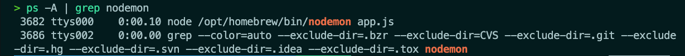

# Express.js

This app will help me take a deeper look into the Express.js framework. I will be looking at the documentation and following along with their tutorials. I will also be looking at other resources to help me understand the framework better.

The documentation can be found here: https://expressjs.com/en/starter/installing.html

<br/>

## Installation

```bash
mkdir my_testing_app
cd my_testing_app
```

The documentation then also says to run the following command:

```bash
npm init -y
```

This command will create a package.json file. This file will contain all the dependencies for the project. The -y flag will skip the prompts and just create the file.

The only difference I see from this command and the one used in class is that in class we use:

```bash
npm init
```

This command will prompt you for the information needed to create the package.json file. The command used in class does allow you to designate a `main` file, as opposed to when we use the `-y` flag. Which defaults main to be `index.js`.

For the purposes of class we will declare the main file as `app.js`. But let's continue with the `express.js` documentation.

The next step is to install `express.js` into our project. We can easily accomplish this by running the command below:

```bash
npm install express --save
```

In the command above we see a different flag: `--save`.

The `--save` flag will add the dependency to the package.json file. This will allow us to easily install all the dependencies for a project when we clone it down from GitHub in the future in another directory.

The documentation also specifies another command if we wish to install `express.js` temporarily:

```bash
npm install express --no-save
```

Upon reading the fine print in the documentation it states that just running the command:

```bash
npm install express
```

Will install the dependency and add it to the package.json file. This is done by default with npm version 5.0.0 and above. So let's run that command.

To shorten the command even more I found out we can just run:

```bash
npm i express
```

This will literally just do what we want without having to write the whole command or in this case the whole word ... `install`. xD

<br/>

# Entry Point

In order to combine both the logic of the documentation and the logic learned in class I will do my best to mesh the two together. Our default entry point according to the documentation is `index.js`. But in class we learned that we can change this to `app.js`. So let's do that.

In the `package.json` file we will change the `main` property to be `app.js`.

```json
"main": "app.js"
```

Let's create that file:

```bash
touch app.js
```

Creating an entry point file called `app.js` will allow the app we are creating to execute the code in that file when we run the command:

```bash
node app.js
```

The code stored in this file will define the routes and middleware for our application. The logic written in `app.js` will be the logic that will be executed when a user visits a specific route. It will handle different HTTP requests and return the appropriate responses.

<br/>

### Pro-Tip

When creating a `.gitignore` file for any project and you want it filled with default values for a react-app which is what we've been working on you can use the following `npm` package:

```bash
npx react-gitignore
```

<br/>
<br/>
<br/>

# Routes & Middleware

Routes and middleware are two key concepts in `express.js` that are used to define the behavior of the application we are building.

<br/>

## Routes

Routes are used to define how the application will respond to HTTP requests. A route is defined using the `app.METHOD()` syntax, where the `METHOD` is the HTTP request method, in lowercase. The following code is an example of a route that will respond with `Hello World!` to GET requests to the root route, or `/`:

```js
app.get("/", (req, res) => {
  res.send("Hello World!");
});
```

The first argument of the `app.get()` function is the path of the route. In this case it would be the `home` path defined by `/`. The second argument is the callback function that will be executed when the `home` route is matched.

The callback function takes two arguments: `req` and `res`. The `req` argument represents the HTTP request and has properties for the request query string, parameters, body, HTTP headers, and so on. The `res` argument represents the HTTP response that the Express app will send when it receives an HTTP request.

Since the second argument of the `app.get()` function is a callback function we can also create a separate function to handle the request and response. This will allow us to keep our code organized and clean.

```js
const homeHandler = (req, res) => {
  res.send("Hello World!");
};

app.get("/", homeHandler);
```

<br/>

Furthermore to keep code organized we can use the `express.Router()` class to create modular, mountable route handlers. A Router instance is a complete middleware and routing system; for this reason, it is often referred to as a `mini-app`. At this point in time I feel that this is a bit too much for me to understand. So I will continue to follow the documentation and come back to this later.

<br/>

The following code creates a simple `app` that will respond with `Hello World!` to GET requests to the root route, and `About me` to GET requests to the `/about` route:

```js
const express = require("express");
const app = express();

const homeHandler = (req, res) => {
  res.send("Hello World!");

const aboutHandler = (req, res) => {
  res.send("About me");
};

app.get("/", homeHandler);

app.get("/about", aboutHandler);

module.exports = app;
```

<br/>

The `module.exports` line is used to export the `app` object so that it can be used in other files. This is done so that we can use the `app` object in our `app.js` file.

<br/>

## Middleware

In `express.js` middleware are functions that can be executed before the final request handler callback is invoked. Middleware functions have access to the `request` and `response` objects. This means that they can perform operations on them, such as modifying request headers, processing data, handling errors, or even ending the request-response cycle.

One thing to note about middleware is that they are executed in the order that they are defined. This is important to keep in mind when defining middleware functions. Each middleware function has the ability to modify the request and response objects. This means that middleware functions can perform the following tasks:

- Execute any code.
- Make changes to the request and the response objects.
- End the request-response cycle.

If the current middleware function does not end the request-response cycle, it must call `next()` to pass control to the next middleware function. Otherwise, the request will be left hanging.

<br/>

Without going to deep into this topic I will write an example of middleware functions:

```js
const express = require("express");
const app = express();

// middleware function that will log the current date and time
const logDateTime = (req, res, next) => {
  console.log(new Date());
  next();
};

// middleware function that will log the user agent header
const logUserAgent = (req, res, next) => {
  console.log(req.headers["user-agent"]);
  next();
};

// route handler
const rootHandler = (req, res) => {
  res.send("Hello World!");
};

// register the middleware functions
app.use(logDateTime);
app.use(logUserAgent);

// register the route handler
app.get("/", rootHandler);

module.exports = app;
```

<br/>

The code above defines two middleware functions called `logDateTime` and `logUserAgent`. These functions will log the current date and time and the user agent header respectively. The `logDateTime` function will call the `next()` function to pass control to the next middleware function. The `logUserAgent` function will also call the `next()` function to pass control to the next middleware function. In this case there is no next middleware function. So the request-response cycle will end.

<br/>

### Registering Middleware

We register middleware functions by calling the `app.use()` function. The `app.use()` function can be called with a single argument. This argument can be a function or a path. If the argument is a function then the function will be registered as a middleware function. If the argument is a path then the function will be registered as a route handler.

<br/>

## Use of middleware

When we start the server, we can see the middleware functions in action in the console. First is the `logDateTime` function and the next would be the `logUserAgent` function. The following is the output of the code above:

```bash
2020-05-31T20:00:00.000Z

Mozilla/5.0 (Macintosh; Intel Mac OS X 10_15_4) AppleWebKit/537.36 (KHTML, like Gecko) Chrome/83.0.4103.116 Safari/537.36
```

These would be outputed to the console when we visit the root route. The `logDateTime` function will log the current date and time. The `logUserAgent` function will log the user agent header.

<br/>

# We've deviated from the documentation tutorials long enough. Let's get back on track!

<br/>

# Hello World

Let's start with the most basic of examples. We will create a simple `Hello World` app. This will be a great way to get started with Express.js.

First we will need to import the `express` module into our `app.js` file. The same `express` that we installed previously.

We will do this by using the `require` function. We will also need to create an instance of the `express` module. We will do this by calling the `express` function.

```js
const express = require("express");
const app = express();
```

The first line in the code above not only imports the `express.js` module but also assigns it to the variable `express`. This is done so we can use the `express` variable to call the `express` function.

The second line creates an instance of the `express.js` module and assigns it to the variable `app`. This will allow us to use the `app` variable to call the methods of the `express.js` module. The `app` variable can also be described as an object that contains all the methods of the `express.js` module.

<br/>
 
## Port Number

The next thing we need to do is to define the port number that our server will listen on. We will do this by creating a variable called `port` and assigning it the value `3000`.

```js
const port = 3000;
```

In class we've gone a step further and created a `.env` file to store our port number. This is a great way to keep our port number secure.

We can do this by creating a `.env` file in the root directory of our project. We will then add the following line to the `.env` file:

```bash
PORT=3000
```

<br/>

## Using the `.dotenv` npm package

We can then access the port number by using the `process.env` object. The `process.env` object is a global object that contains all the environment variables as properties. We can access the port number by using the following code:

```js
const port = process.env.PORT;
```

At this time this will not work. This is because this is a simple `Hello World` app. We will need to install the `dotenv` module to make this work. We can do this by running the following command in the terminal:

```bash
npm i dotenv
```

Now we can update our code to take advantage of this package we've installed. We will need to import the `dotenv` module into our `app.js` file. We can do this by writting the following line of code in our `app.js` file:

```js
require("dotenv").config();
```

The `require` function will import the `dotenv` module into our `app.js` file. The `config()` function will load the environment variables from the `.env` file into the `process.env` object.

While checking my notes against `chatGPT` it mentioned that it is good practice to wrap the `require` function in a conditional statement. This is to prevent the `dotenv` module from being loaded in production. We can do this by writting the following code:

```js
if (process.env.NODE_ENV !== "production") {
  require("dotenv").config();
}
```

At this time this information even though it is insightful, it is not necessary at this moment where we are following the tutorials in the `express.js` documentation.

<br/>

Now we can finally update our code to use the `process.env` object to access the port number. We can do this by writting the following code:

```js
const port = process.env.PORT;
```

So far I'm understanding the logic of the code that I'm writing. Right now I'm using different sources at the same time to get a better understanding of what I'm doing. I'm using the `express.js` documentation, the class notes, and the infamous `chatGPT` to double check my notes.

Our code should look something like this right now:

```js
require("dotenv").config();

const express = require("express");
const app = express();

const PORT = process.env.PORT || 3000;
```

<br/>

## Route Handler

The next thing we need to do is to create a route handler. We will do this by calling the `app.get()` function. The `app.get()` function takes two arguments. The first argument is the path. The second argument is the route handler. The route handler is a function that will be called when the path is requested. I like to keep my code clean and organized. So I will create a separate function for the route handler. I will call this function `rootHandler`. The `rootHandler` function will take two arguments. The first argument is the `request` object. The second argument is the `response` object. The `request` object contains all the information about the request. The `response` object contains all the methods to send a response to the client.

```js
const rootHandler = (req, res) => {
  res.send("Hello World!");
};

app.get("/", rootHandler);
```

After this we can start the server by calling the `app.listen()` function. The `app.listen()` function takes two arguments. The first argument is the port number. The second argument is a callback function. The callback function will be called when the server is started.

```js
app.listen(port, () => {
  console.log(`Server started on port ${port}`);
});
```

<br/>

## Running the server

There are two commands that can start running our server. The first command is `node app.js`. The second command is `nodemon app.js`. The `nodemon` command will start the server and will restart the server whenever a change is made to the code. The `node` command will only start the server once. We will use the `nodemon` command for this tutorial.

```bash
nodemon app.js
```

<br/>

### Pro-Tip

Sometimes we may forget to kill the server correctly before putting the computer to sleep and the next time you try to start your server it says that something is already running on that port. To fix this we must first find the process to do this we can run the `ps` command (process status) combined with the `-A` flag (all). This will list all the processes that are currently running. We can then use the `grep` command (global regular expression print) to filter the results and search for nodemon specifically. We can do this by running the following command:

```bash
  ps -A | grep nodemon
```

If `nodemon` is running, you should see something like this:


